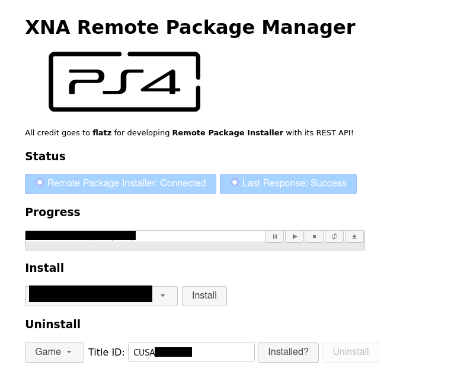

## Remote Package Manager by XNA

This is a lightweight installation manager for pkg files.
It comes with a fully dynamic front-end using only jquery, jquery-ui and js-cookie (for storing tasks).
NodeJS/NPM is the only component required to run the webserver.

The manager can run on a headless server (no desktop needed). Ideally this server should be have direct and fast access to pkg files!

### Prerequisites
- NodeJS
- NPM (Node Package Manager)
- PS4 Remote Package Installer

### Installation 
1. Clone repository, `cd` into extracted directory
2. Install modules: `npm install`
3. Edit `config.json` (see below)
4. Start server:
* To start in foreground (e.g. in `screen`): `node index.js`
* To start in background: `nohup node index.js &`

#### Configuration:
Edit `config.json`:
* pkgfolder: Full path to the folder containing your pkg files, must be accessible from server!
* myip: IP address of your server
* ps4ip: IP address of your PS4

optional:
* myport: Port of server / landing page

Remember to enable the configured port in your firewall!

#### Optimizing transfer speed:
With all your devices connected via Gigabit LAN (1000BASE-T) you should be able to reach transfer speeds of more than 20 MB/s.
Given that, the installation of a 40GB pkg file takes around 30 mins.

To optimize transfer speed check the following points:
1. Server has 'fast' access to the configured `pkgfolder`, either directly or via Gigabit connection (for SMB share make sure to use SMB v3.0)
2. Server and PS4 are connected to eachother via Gigabit LAN (1000 Mbit/s router/switch + Cat 5e/6/7 cables)

### Building and running Docker container
Needed: [Docker](https://docs.docker.com/get-docker/)

1. Edit `config.json` (see "Configuration" section)
2. Build Docker container with: `docker build -t xna_rpkgman .`
3. Run Docker container with: `docker run -d -p <myport>:<myport> xna_rpkgman:latest`

Note: '<myport>' corresponds to 'myport' in `config.json`. For the default port the command would be `docker run -d -p 9999:9999 xna_rpkgman:latest`.

### Credits
All credit goes to **flatz** for creating the [Remote Package Installer](https://github.com/flatz/ps4_remote_pkg_installer)!

### Donations
BTC: bc1qut876f99mqs9etd827mhgxew25t5s6drxzz2ks
ETH: 0x3279f75D9656405E6189a4413e0eaE476eeEc7F8
